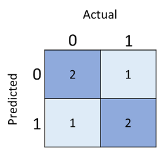

# Azure Automated ML

[Azure Automated ML](./docs/AutoML.pdf)

## Important Links

1. [ml-basics github](https://github.com/MicrosoftDocs/ml-basics.git)
2. [exercise-explore-data](https://docs.microsoft.com/en-us/learn/modules/explore-analyze-data-with-python/2-exercise-explore-data)
3. [Python examples](./demo001-python/README.md)

## Terms

## RMSE

One of the most common ways to measure the loss is to square the individual residuals, sum the squares, and calculate 
the mean. Squaring the residuals has the effect of basing the calculation on absolute values (ignoring whether the 
difference is negative or positive) and giving more weight to larger differences. This metric is called the Mean Squared 
Error.

For our validation data, the calculation looks like this:

|y	| ŷ | 	y - ŷ|	(y - ŷ)2|
|---|---|---|---|
|156|	159.4|	-3.4|	11.56|
|114|	111.8|	2.2|	4.84|
|129|	125.4|	3.6|	12.96|
|Sum|	| | ∑	29.36
|Mean|	| | x̄	9.79
So the loss for our model based on the MSE metric is 9.79.

So is that any good? It's difficult to tell because MSE value is not expressed in a meaningful unit of measurement. 
We do know that the lower the value is, the less loss there is in the model; and therefore, the better it is predicting. 
This makes it a useful metric to compare two models and find the one that performs best.

Sometimes, it's more useful to express the loss in the same unit of measurement as the predicted label value itself - 
in this case, the number of rentals. It's possible to do this by calculating the square root of the MSE, which produces 
a metric known, unsurprisingly, as the **Root Mean Squared Error (RMSE)**.

√9.79 = 3.13

So our model's RMSE indicates that the loss is just over 3, which you can interpret loosely as meaning that on average, 
incorrect predictions are wrong by around 3 rentals.

There are many other metrics that can be used to measure loss in a regression. For example, R2 (R-Squared) (sometimes 
known as coefficient of determination) is the correlation between x and y squared. This produces a value between 0 and 
1 that measures the amount of variance that can be explained by the model. Generally, the closer this value is to 1, 
the better the model predicts.

## Confusion Matrix

We can tabulate the results in a structure called a confusion matrix, like this:

A confusion matrix showing 2 true-negatives, 2 true-positives, 1 false-negative, and 1-false positive

The confusion matrix shows the total number of cases where:

The model predicted 0, and the actual label is 0 (true negatives)
The model predicted 1 and the actual label is 1 (true positives)
The model predicted 0 and the actual label is 1 (false negatives)
The model predicted 1 and the actual label is 0 (false positives)
The cells in the confusion matrix are often shaded so that higher values have a deeper shade. This makes it easier to see a strong diagonal trend from top-left to bottom-right, highlighting the cells where the predicted value and actual value are the same.

From these core values, you can calculate a range of other metrics that can help you evaluate the performance of the model. For example:

Accuracy: (TP+TN)/(TP+TN+FP+FN) - in other words, out all of the predictions, how many were correct?
Recall: TP/(TP+FN) - in other words, of all the cases that are positive, how many did the model identify?
Precision: TP/(TP+FP) - in other words, of all the cases that the model predicted to be positive, how many actually are positive?

