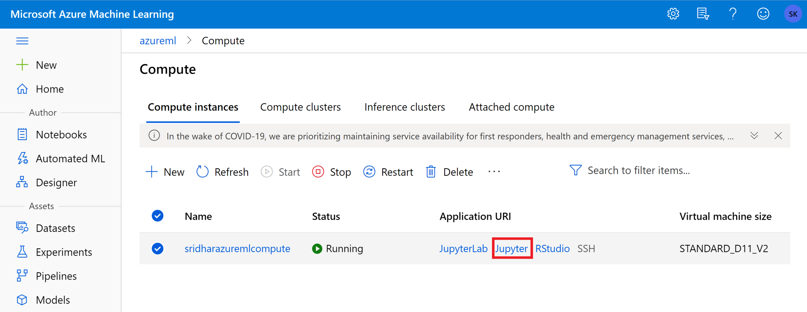
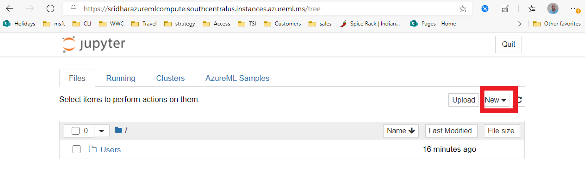
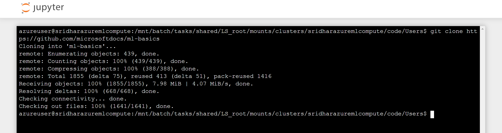
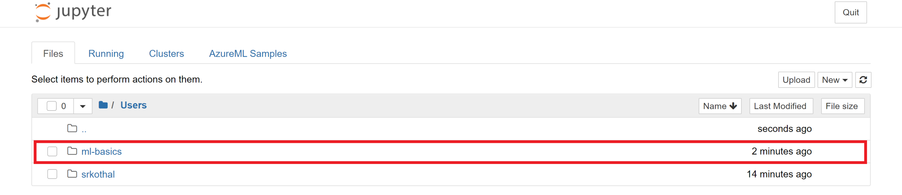

# Explore data

## Create compute in machine learning services

## Access Jupyter notebooks

## Open terminal

## Clone git repository

## Explore data in Jupyter notebook

## Open the notebook

Open the notebook folder and check out the examples. The same code is available in the "notebook" folder above

