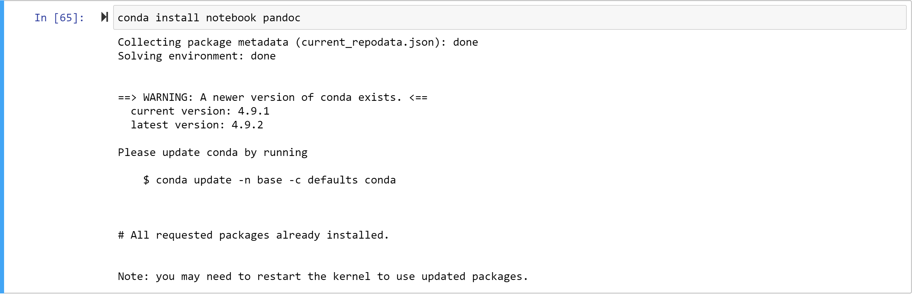

# Explore data

## Create compute in machine learning services

## Access Jupyter notebooks

## Open terminal

## Clone git repository

## Explore data in Jupyter notebook

## Open the notebook

Open the `Data Exploration.ipynb` in the ml-basics folder

## Install pandoc to export notebook to pdf

Install pandoc

After install restart the kernel

##

